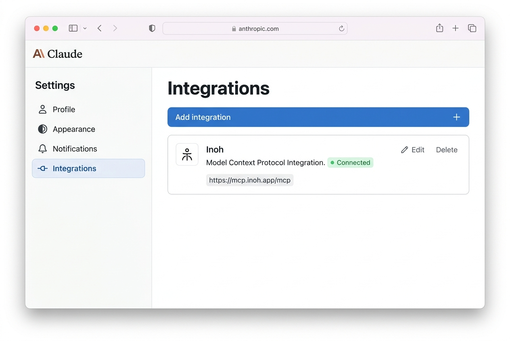
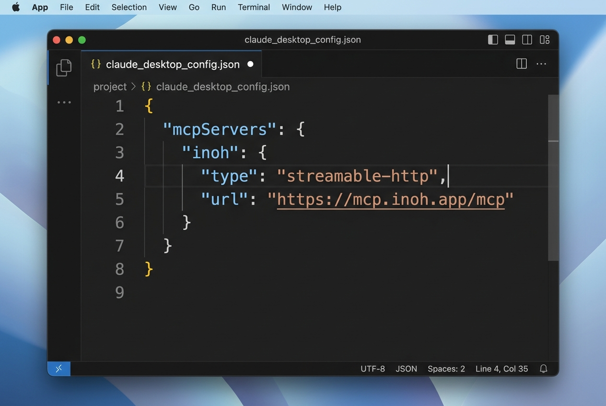
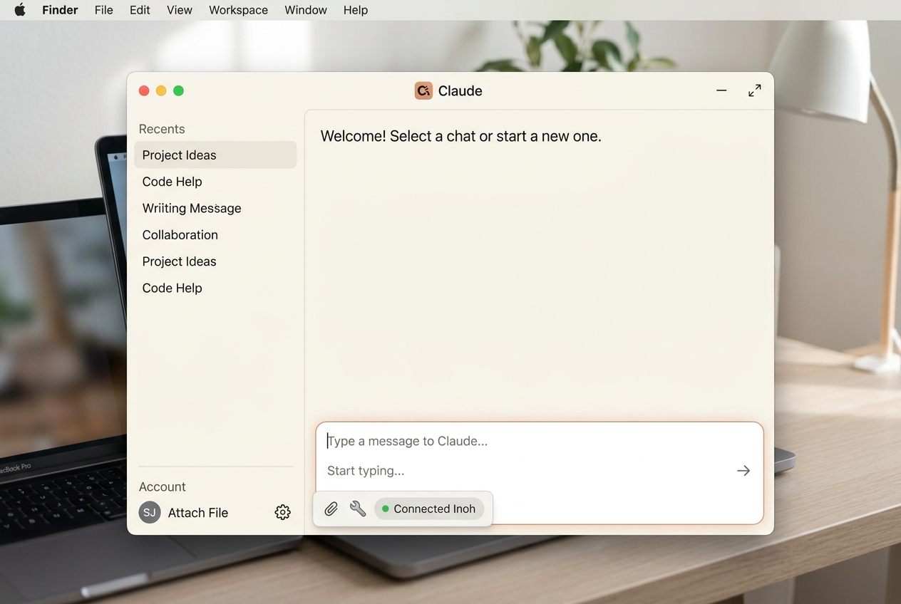
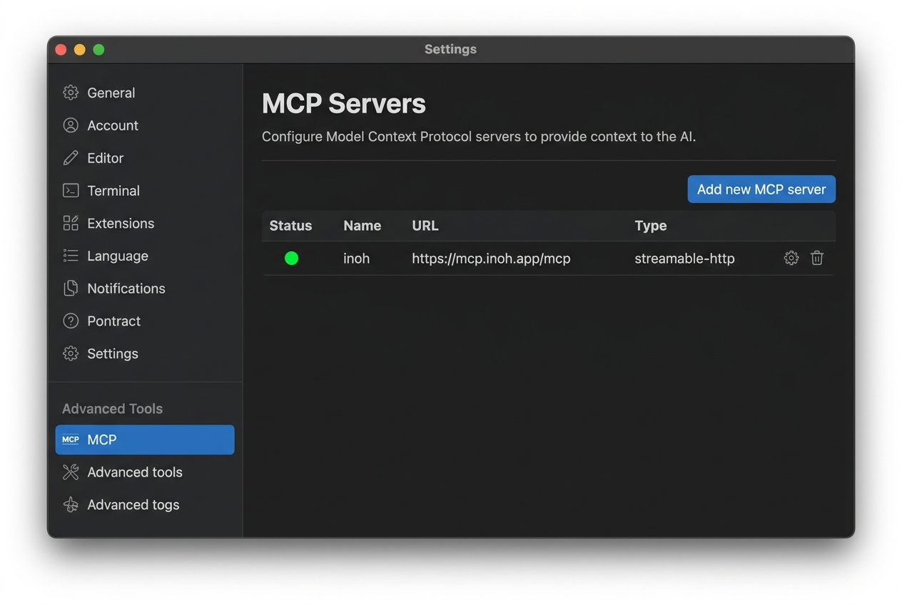
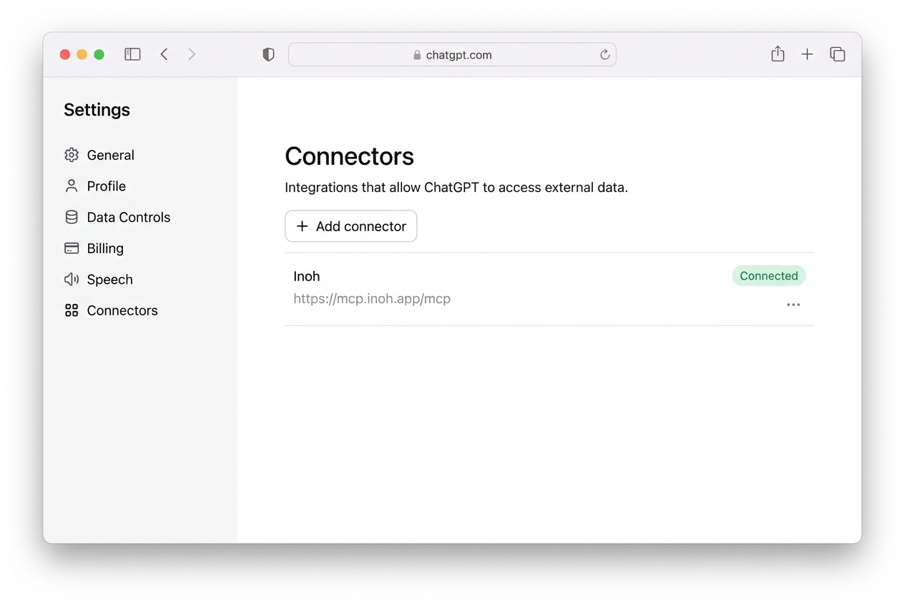
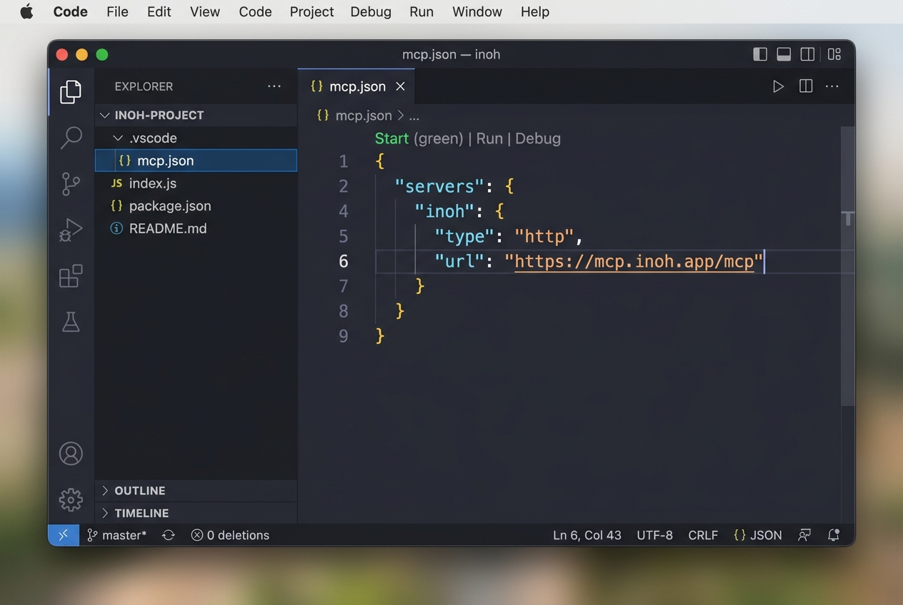

# Connecting Inoh to Your AI

> For what Inoh MCP does, the tool list, and how cards work, see the
> [README](../README.md). This page covers only how to connect it.

Nothing installs on your computer. You are just telling your AI where to find Inoh on the
internet. The address it needs is:

```
https://mcp.inoh.app/mcp
```

The first time you ask your AI to do something with Inoh, a sign-in tab will open in your
browser. Sign in with your [Inoh account](https://app.inoh.app) and approve access. That is it.

Every step below installs Inoh **for your whole user account**, so it is available in every
project and folder you work in. Where a tool can also install per-project, that is called out
as the alternative rather than the default.

Pick your AI below.

---

## Claude

### Claude.ai (the website)

1. Click your profile picture in the top-right corner and go to **Settings**.
2. Click **Integrations** in the left sidebar.
3. Click **Add integration**.
4. Paste `https://mcp.inoh.app/mcp` into the URL field and name it **Inoh**.
5. Click **Add**.

Once added, Inoh will appear in your integrations list with a green **Connected** badge.



Start a new conversation and try: _"Add serendipity to my Inoh deck."_

---

### Claude Desktop (the Mac or Windows app)

Claude Desktop uses a settings file to know which tools to connect to. You need to add a few
lines to that file. There is one such file per installation, so this applies to Claude Desktop
as a whole, not to any single project.

**Step 1 - Find the file**

- **Mac:** Open Finder, press `Cmd+Shift+G`, paste the path below, and press Enter:
  `~/Library/Application Support/Claude/claude_desktop_config.json`
- **Windows:** Press `Win+R`, paste the path below, and press Enter:
  `%APPDATA%\Claude\claude_desktop_config.json`

The file will open in your default text editor. If it does not exist yet, create it.

**Step 2 - Add Inoh**

If the file is empty, paste the entire block below. If it already has content, carefully
add the `"inoh"` section inside the existing `"mcpServers"` block.

```json
{
  "mcpServers": {
    "inoh": {
      "type": "streamable-http",
      "url": "https://mcp.inoh.app/mcp"
    }
  }
}
```



**Step 3 - Save and restart**

Save the file, then quit and reopen Claude Desktop. A sign-in tab will open the first time
you use Inoh.



---

## Cursor

1. Open **Cursor Settings** (gear icon, or `Cmd+,` on Mac / `Ctrl+,` on Windows).
2. In the sidebar, find **Features -> MCP** and click **Add new MCP server**.
3. Fill in:
   - **Name:** `inoh`
   - **Type:** `streamable-http`
   - **URL:** `https://mcp.inoh.app/mcp`
4. Click **Save**.

You should see Inoh in the MCP Servers list with a green dot.



Adding it through Settings stores it in `~/.cursor/mcp.json`, which applies to every project.
A `.cursor/mcp.json` inside a project folder would apply to that project only.

---

## Windsurf

1. Open the **Cascade** panel on the right side of Windsurf.
2. Click **MCP Servers -> Add server -> Add custom server**.
3. Paste the block below into the editor that appears:

```json
{
  "name": "inoh",
  "type": "streamable-http",
  "serverUrl": "https://mcp.inoh.app/mcp"
}
```

4. Click **Save**.

---

## ChatGPT

Available on **Plus, Team, and Enterprise** plans.

1. Go to [chatgpt.com](https://chatgpt.com) and click your profile picture.
2. Open **Settings -> Connectors**.
3. Click **Add connector -> MCP Server**.
4. Enter `https://mcp.inoh.app/mcp` as the URL and **Inoh** as the name.
5. Click **Save** and sign in when prompted.

Inoh will appear in the Connectors list once connected.



> This feature is rolling out gradually. If you do not see **Connectors** in Settings, check
> back in a few days.

---

## Gemini / Google AI Studio

1. Open [aistudio.google.com](https://aistudio.google.com).
2. Click the plug icon (**Extensions**) in the left panel.
3. Choose **Add extension -> Custom MCP server**.
4. Enter:
   - **Server URL:** `https://mcp.inoh.app/mcp`
   - **Name:** `Inoh`
5. Click **Connect** and sign in when the browser tab opens.

---

## VS Code (with GitHub Copilot)

You will need GitHub Copilot and Agent mode enabled in VS Code.

Run this in your terminal. It adds Inoh to your VS Code **user profile**, so it is available in
every folder you open:

```bash
code --add-mcp '{"name":"inoh","type":"http","url":"https://mcp.inoh.app/mcp"}'
```

Then open the Copilot Chat panel, switch to **Agent** mode, and Inoh will appear in the tools
list.

**Just one project instead?** Create `.vscode/mcp.json` in the project folder with the block
below. A **Start** button appears above the `"inoh"` line; click it to connect.

```json
{
  "servers": {
    "inoh": {
      "type": "http",
      "url": "https://mcp.inoh.app/mcp"
    }
  }
}
```



---

## Zed

`Cmd+,` opens your Zed **user** settings, so this applies to every project.

1. Press `Cmd+,` to open Settings.
2. Click **Assistant** then **Edit JSON**.
3. Add the following inside the outermost `{` `}` brackets and save:

```json
"context_servers": {
  "inoh": {
    "transport": {
      "type": "http",
      "url": "https://mcp.inoh.app/mcp"
    }
  }
}
```

---

## Terminal / CLI tools

These tools run in your terminal. One command registers Inoh and it will be available in every
session from that point on.

---

### Claude Code

```bash
claude mcp add --scope user --transport http inoh https://mcp.inoh.app/mcp
```

`--scope user` is what makes Inoh available in every folder. Leave it out and Claude Code
defaults to `--scope local`, which registers Inoh only for the directory you happened to run
the command in, and it will look missing everywhere else. The output line tells you which one
you got: `to user config` rather than `to local config`.

Confirm it was added:

```bash
claude mcp list
```

A browser sign-in tab will open the first time you use Inoh in a session.

---

### Codex CLI

```bash
codex mcp add inoh --url https://mcp.inoh.app/mcp
```

Codex has no scope flag: it always writes `~/.codex/config.toml`, so this is user-wide either
way.

Confirm it was added:

```bash
codex mcp list
```

Or manually add it to `~/.codex/config.toml`:

```toml
[mcp_servers.inoh]
url = "https://mcp.inoh.app/mcp"
```

To verify Inoh is active inside a Codex session, run `/mcp`.

---

### Grok CLI

```bash
grok mcp add --scope user --transport http inoh https://mcp.inoh.app/mcp
```

`user` is already Grok's default, so the flag is belt and braces. `--scope project` would write
`./.grok/config.toml` instead, shared with anyone working in that folder.

Confirm it was added:

```bash
grok mcp list
```

Or manually add it to `~/.grok/config.toml`:

```toml
[mcp_servers.inoh]
url = "https://mcp.inoh.app/mcp"
```

Grok will open a browser sign-in tab on first use and store the token automatically.

> **Scope:** these three CLIs disagree on where they write by default, which is worth knowing if
> you ever drop the flags above. **Claude Code** defaults to `local`, the current folder only, so
> `--scope user` is doing real work there — without it Inoh looks missing from every other
> directory. **Grok** already defaults to `user`. **Codex** has no scope flag and is always
> user-wide.

---

## Check that it worked

Once connected, ask your AI:

> _"Check my Inoh account."_

It should reply with the email address you used to sign in to Inoh. If it does, everything
is set up correctly.

---

## Something not working?

- **No sign-in tab appeared.** Try sending your AI another message that mentions Inoh. Sometimes
  it takes a second request to trigger the first connection.
- **Claude Desktop shows no tools.** Double-check that you saved the config file and fully quit
  and reopened the app (not just closed the window).
- **The config file looks broken.** JSON is sensitive to missing commas and brackets. Paste your
  file into [jsonlint.com](https://jsonlint.com) to check for errors.
- **Still stuck?** Open an issue on [GitHub](https://github.com/inoh-app/inoh-mcp).
